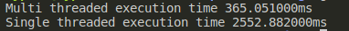

# Multithreaded harshad number calculator
This program implements a function to find harshad numbers between a certain range using either a single threaded or multi threaded approach.

## Known flaws
- Some numbers at the end of the range might be missed due to integer division.
- Program leaks memory, used memory is not freed.

## Instructions
Start by modifying the range and thread count using the source and,

    gcc main.c -o a.out
    ./a.out

## Console output

